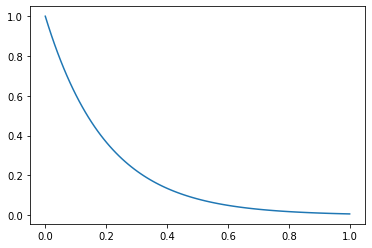
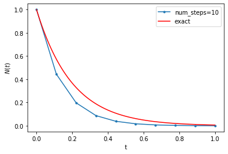
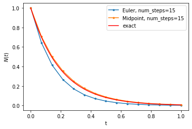

Differential equations: Useful to model time evolution of states in unknown system

In NN each layer is a series of discrete transformations:

\begin{align}
h_{t+1} = f(h_t)
\end{align} 

t = layer index can be interpreted as time index

i.e. transform input data (at t=0) to output space (t=N)

problems where continuous variable more useful (e.g. physical simulations) -> express as differential equation

## Initial Value problem

\begin{align}
\frac{dh(t)}{dt} = g(t, h(t))\\
\frac{dy}{dx} = g(x, y)
\end{align}

initial value $h(t=0) = h_0$


```python
# e.g. Radioactive decay dN(t)/dt = -Lambda*N(t)

t = np.linspace(0,1,100)
λ = 5.0
N = lambda t: np.exp(-λ*t)

plt.plot(t, N(t))
```


    [<matplotlib.lines.Line2D at 0x7f47003d26d0>]





### Differential equation-> Integral form

\begin{align}
\frac{dh(t)}{dt} = g(t, h(t))
\end{align}

\begin{align}
h(T) = h(0) + \int_{0}^{T}g(t, h(t))dt
\end{align}

## Solving the ODE

Use numerical methods which approximate the solution

\begin{align}
h(N\Delta t) = h(0) + \Delta t \sum_{k=0}^{N-1}g(k\Delta t, h(k\Delta t))
\end{align}

In short: 

\begin{align}
h_N = h_0 + \Delta t \sum_{k=0}^{N-1}g(k\Delta t, h_k)\\
h_N = h_0 + \Delta t \sum_{k=0}^{N-2}g(k\Delta t, h_k)  + \Delta t g((N-1)\Delta t, h_{N-1}) \\
h_N = h_{N-1}  + \Delta t g((N-1)\Delta t, h_{N-1}) \\
\end{align}


This is Euler's method


```python
hist = []
# fixed grid
num_steps = 10
Δt = 1/num_steps
# initial condition
Nk = 1.0;
tk  = 0.0
# integration
hist.append((tk, Nk))
for k in range(num_steps):
    Nk = Nk - λ * Δt * Nk
    tk  = tk + Δt
    hist.append((tk, Nk))
```


```python
plt.plot(*np.array(hist).T, '.-', label='num_steps=10')
plt.plot(t, N(t), 'r', label='exact')
plt.xlabel("t")
plt.ylabel("$N(t)$")
plt.legend()
```


    <matplotlib.legend.Legend at 0x7f46e09fdfd0>


## Euler's Method -> Black Box solvers


```python
def g_fn(tk, hk):
    return - λ * hk

def euler_step(dt, tk, hk, fun):
    return hk + dt * fun(tk, hk)
```


```python
hist = []
# fixed grid
num_steps = 10
Δt = 1/num_steps
# initial condition
Nk = 1.0;
tk  = 0.0
# integration
hist.append((tk, Nk))
for k in range(num_steps):
    Nk = euler_step(Δt, tk, Nk, g_fn)
    tk  = tk + Δt
    hist.append((tk, Nk))
```


```python
plt.plot(*np.array(hist).T, '.-', label='num_steps=10')
plt.plot(t, N(t), 'r', label='exact')
plt.xlabel("t")
plt.ylabel("$N(t)$")
plt.legend()
```


    <matplotlib.legend.Legend at 0x7f46e090a390>


## A black-box solver


```python
def odeint(func, y0, t, solver):
    Δts = t[1:] - t[:-1]
    tk = t[0]
    yk = y0
    hist = [(tk, y0)]
    for Δt in Δts:
        yk = solver(Δt, tk, yk, func)
        tk = tk + Δt
        hist.append((tk, yk))
    return hist
```


```python
hist = odeint(
    func=g_fn, 
    y0=1.0, 
    t=np.linspace(0, 1, 10), 
    solver=euler_step
)
```


```python
plt.plot(*np.array(hist).T, '.-', label='num_steps=10')
plt.plot(t, N(t), 'r', label='exact')
plt.xlabel("t")
plt.ylabel("$N(t)$")
plt.legend()
```


    <matplotlib.legend.Legend at 0x7f46e0804250>





## Higher-order methods


```python
def midpoint_step(Δt, tk, hk, fun):
    k1 = fun(tk, hk)
    k2 = fun(tk + Δt, hk + Δt * k1)
    return hk + Δt * (k1 + k2) / 2
```


```python
t_grid = np.linspace(0, 1, 15)
hist_euler = odeint(g_fn, 1.0, t_grid, euler_step)
hist_midpoint = odeint(g_fn, 1.0, t_grid, midpoint_step)
```


```python
plt.plot(*np.array(hist_euler).T, '.-', label='Euler, num_steps=15')
plt.plot(*np.array(hist_midpoint).T, '.-', label='Midpoint, num_steps=15')
plt.plot(t, N(t), 'r', label='exact')
plt.xlabel("t")
plt.ylabel("$N(t)$")
plt.legend()
```


    <matplotlib.legend.Legend at 0x7f46e07f2ad0>





```python

```
