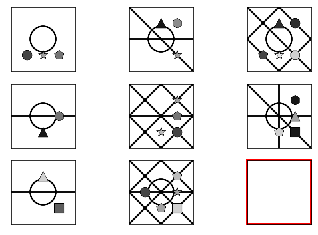

_In this blog post I will go over the problem of abstract visual reasoning; which has recently emerged as a challenging domain for machine learning tasks. Before I do that I will explain the issues with 'conceptual' generalisation in machine learning._

_After that, I will explain the problem setting of Raven's Progressive Matrices which serve as a test-bed for abstract reasoning ability, discuss two datasets released for machine learning research on this problem, go through a couple of the models with code in Pytorch and leave you with some open questions. Hopefully this blog post generates as much of an interest in this problem as it did for me while reading these papers. Let's dive right in!_

# 1. Conceptual generalisation

Generalisation has proven to be a very hard nut to crack for artificial intelligence. In simple terms, generalisation is the ability of a model to perform well on previously unseen data. It's important to clarify here what we mean by unseen data. In your regular Machine Learning 101 class you'd think of this as the test split of the data whose training split your model has learned on. While this definition of 'unseen data' is most definitely true, we can expand on it in more conceptual terms, which leads to several ideas of generalisation:  

### Domain adaptation 
When the test and train data are from different 'domains' then the problem of generalisation is referred to as domain adaptation. What does different domains mean? Think of it as having the training data and test data from different probability distributions: 

$$
\begin{aligned}
\text{train data} \ X \sim P(x_1,x_2,...,x_n) \\
\text{test data} \ Y \sim G(x_1,x_2,....,x_n) \\
\end{aligned}
$$

How different can these distributions be? In most research use-cases they are not that different. For example take the case of images:


<p style="text-align: center;">Image source: <a href="https://ruder.io/transfer-learning/">Sebastien Ruder's blog</a></p>


If you think of the underlying distribution to factored along a certain number of latent variables usually domain adaptation involves adapting to the change in distribution of one (or a few) of the latent variables:

$$
\begin{aligned}
\text{train data} \ X &\sim P(x_1,x_2,...,x_n) \\
\Rightarrow X &\sim p_1(x_1)p_2(x_2)...p_k(x_k)...p_n(x_n) \\
\text{test data} \ Y &\sim G(x_1,x_2,....,x_n) \\
\Rightarrow Y &\sim p_1(x_1)p_2(x_2)...g_k(x_k)...p_n(x_n) \\
\end{aligned}
$$

In the case of the bike examples shown above think of $x_k$ as a variable representing backgrounds where $p_k$ is a distribution of clear backgrounds and $g_k$ is a distribution of cluttered backgrounds. In several applications this change in distribution can be modelled simply as a change in the mean of $p_k$ or a similar small change.

### Compositional generalisation 

A lot of human intelligence is compositional in nature. In order to explain compositionailty let me give you an example of the steps I followed when I had to travel from Gorakhpur, India to Guelph, Canada for grad school:  

1. Drive(my house -> Gorakhpur airport) 
2. Flight(Gorakhpur->Delhi) 
3. Switch terminals(Delhi domestic->Delhi international) 
4. Flight(Delhi->Frankfurt) 
5. Switch terminals(Frankfurt arrivals->Frankfurt departures) 
6. Flight(Frankfurt->Toronto) 
7. Drive(Toronto airport->Guelph)

You'll notice that several basic steps (driving, catching a flight, changing terminals) are brought together in a certain way in order to complete a seemingly daunting task of travelling over 10000 kilometers from India to Canada (which, by the way, I had never done before)! This is the idea behind compositional generalisation: being able to understand previously seen basic concepts when they are brought together in novel unseen ways. This is demonstrated in the image below:


<p style="text-align: center;">Image Source: <a href="http://proceedings.mlr.press/v80/lake18a">Lake and Baroni</a></p>


### Systematic generalisation

Systematic generalisation can be seen as a superset of compositional generalisation. Besides generalising to novel compositions of previously seen concepts, we would like our models to generalise from few->more instances of the same concepts and vice versa.


# 2. Abstract Reasoning and Raven's Progressive Matrices

Raven's Progressive Matrices [1] (or RPMs for short) are test of visual intelligence administered in humans. An RPM consists of a 3x3 panel of images with the bottom-right image missing. The aim is to follow the abstract pattern used in other rows/columns to fill out this image. For example, in the RPM displayed below the pattern is that the darkened inner quarter of the images in each row rotates clockwise.

|  | 
|:--:| 
| *Image source: [Wikipedia](https://en.wikipedia.org/wiki/Raven%27s_Progressive_Matrices)* |

While they appear quite simplistic at first glance, these tests have been shown to be strongly diagnostic of abstract verbal, spatial and mathematical reasoning ability. They have been found to be good measures of fluid and general intelligence in humans. 


RPMs offer an interesting challenge for artificial intelligence. There are several levels of reasoning involved in solving an RPM-style task: sometimes parallely and other times heirarchically. For the example shown, these reasoning steps could have been:  

* **Relational reasoning:**  
Q: What part of an image panel is involved in the pattern? (A: a quarter)  
Q: How is it changing across the columns? (A: moving clockwise)   
* **Analogical reasoning:**  
Q: How is the dark square in the first row similar to the dark pie-shape in the second row? (A: they both form a quarter of the shape in the full panel)  
* **Spatial reasoning:**  
Q: How does the change in the first column to the second relate to the change in second row to the third? (A: they represent a 90° rotation to the right)  

You might've used some (or all) of these reasoning arguments to conclude that the bottom panel should be the diamond rotated in such a way that it's rightmost square is dark. The question is: Can deep learning do the same?

## 2.1 DeepMind's PGM dataset

In their paper "Measuring abstract reasoning in neural networks" [2], Barrett, Hill and Santoro released a machine-learning scale RPM dataset. This dataset (dubbed Procedurally Generated Matrices or PGM for short) contained a whopping 1.4 million RPM problems. An example of such a problem is shown below:

 
<p style="text-align: center;">Image Source: <a href="http://proceedings.mlr.press/v80/barrett18a.html">Barrett et al</a></p>


```python
from glob import glob
import numpy as np
import os
import matplotlib.pyplot as plt

%matplotlib inline
```


```python
folder = "/mnt/data/sshekhar/Reasoning/data/PGM/"
```

## Neutral


```python
data = np.load(folder+"neutral/PGM_neutral_train_1073149.npz")
```


```python
data
```


    <numpy.lib.npyio.NpzFile at 0x7f4e519f8210>


```python
data.files
```


    ['target',
     'image',
     'relation_structure_encoded',
     'relation_structure',
     'meta_target']


```python
data['image'].shape
```


    (160, 160, 16)


```python
data['target']
```


    array(0)


```python
data['meta_target']
```


    array([1, 1, 0, 0, 1, 0, 1, 0, 0, 1, 0, 0])


```python
data['relation_structure']
```


    array([[b'shape', b'position', b'OR'],
           [b'line', b'type', b'OR']], dtype='|S8')


```python
data['relation_structure_encoded']
```


    array([[1, 0, 0, 0, 1, 0, 0, 0, 0, 1, 0, 0],
           [0, 1, 0, 0, 0, 0, 1, 0, 0, 1, 0, 0],
           [0, 0, 0, 0, 0, 0, 0, 0, 0, 0, 0, 0],
           [0, 0, 0, 0, 0, 0, 0, 0, 0, 0, 0, 0]])


```python
image = data["image"].reshape(16, 160, 160)


# Plot 8 PGM matrices

matfig, mataxs = plt.subplots(3, 3)

plt.setp(mataxs, xticks=[], yticks=[])

row = 0
col = 0

for i in range(8):

    mataxs[row, col].imshow(image[i], cmap="gray")

    col +=1

    if(col%3==0):
        col = 0
        row += 1
        
blank = 255 * np.ones_like(image[0], np.uint8)
        
mataxs[2, 2].imshow(blank, cmap='gray',vmin=0,vmax=1)

## Box
autoAxis = mataxs[2, 2].axis()
rec = plt.Rectangle((autoAxis[0]-0.7,autoAxis[2]-0.2),(autoAxis[1]-autoAxis[0])+1,(autoAxis[3]-autoAxis[2])+0.4,fill=False,lw=2, color="r")
rec = mataxs[2, 2].add_patch(rec)
rec.set_clip_on(False)
        
plt.show()
```





```python
config, conaxs = plt.subplots(2, 4)

plt.setp(conaxs, xticks=[], yticks=[])

row, col = 0, 0

for i in range(8, 16):

    conaxs[row, col].imshow(image[i], cmap="gray")

    col +=1

    if(col%4==0):
        col = 0
        row += 1
        
## Box
autoAxis = conaxs[0, 0].axis()
rec = plt.Rectangle((autoAxis[0]-0.7,autoAxis[2]-0.2),(autoAxis[1]-autoAxis[0])+1,(autoAxis[3]-autoAxis[2])+0.4,fill=False,lw=2, color="r")
rec = conaxs[0, 0].add_patch(rec)
rec.set_clip_on(False)

        
plt.show()
```


## References

[1] Lake, Brenden, and Marco Baroni. "Generalization without systematicity: On the compositional skills of sequence-to-sequence recurrent networks." International Conference on Machine Learning. PMLR, 2018.

[2] Raven, J. C. et al. Raven’s progressive matrices. Western Psychological Services, 1938.

[3] Barrett, David, et al. "Measuring abstract reasoning in neural networks." International Conference on Machine Learning. 2018.